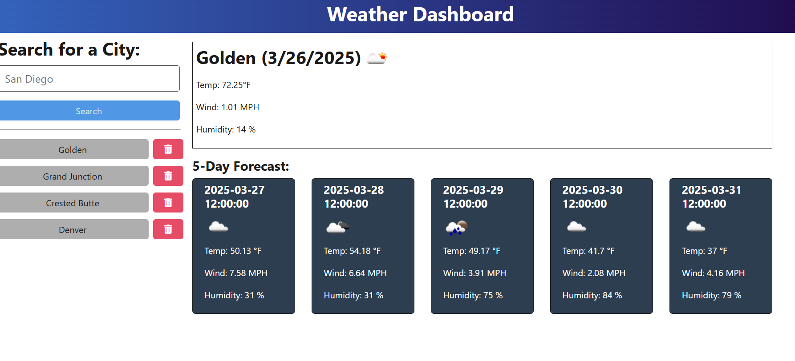

# Week9-Challenge-Repository - Servers and APIs: Weather Dashboard Application

## Table of Contents

- [Description](#description)
- [Installation](#installation)
- [Usage](#usage)
- [Credits](#credits)
- [License](#license)
- [Badges](#badges)

## Description
This application is a weather dashboard that allows the user to type in a city name and hit "Search". The current weather for the typed in city is displayed along with a five day forecast for the city. A button for the  current city is then added to a list of buttons below the Search button. The user can then type in a new city into the search bar to display the forecast for another city. If the user wants to see the forecast for a city previously searched for, the user simply clicks on the button with the city's name. If the wish to remove a city's button from the search history, the user clicks on the button with the trashcan icon to the right of the city name button.
### Application Screenshot

### Technologies Used
The front-end is React with Typescript. The backend uses Express routing with Typescript. The weather data is accessed using the OpenWeather API for weather, forecasts. [5-day weather forecast API](https://openweathermap.org/forecast5) OpenWeather's Geocoding API is used for convering city names to coordinates. A list of previous cities searched for is stored in searchHistory.json. The entire application is deployed to Render

## Installation
All code is located in the gitHub repository https://github.com/SparkKids/Week09-Challenge-Repository

No installation is necessary. The application is already deployed using Render. 

## Usage
[5-day Weather Forecast](https://weather-api-3cse.onrender.com)

## Credits

  Extensive use was made of the BootCamp Xpert Learning Assistant. This AI tool was a valuable learning tool. It helped with debugging and understanding how to write better TypeScript. I also installed GitHub's CoPilot which aided in debugging the code. It often provided helpful code suggestions while I typed (and some suggestions for things that I was not trying to do.)

  I found as I continued coding. I had to rely on the BootCamp Xpert Learning Assistant and CoPilot less often.

  ## License

  This project is licensed under the MIT License - see the [LICENSE](LICENSE) file for details.

 ## Badges

 